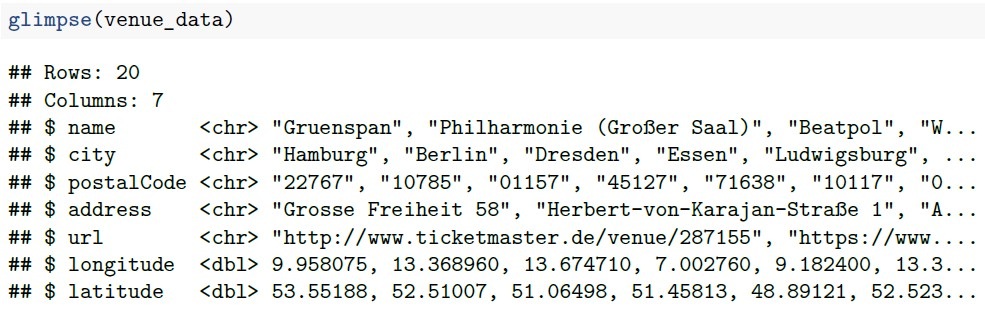
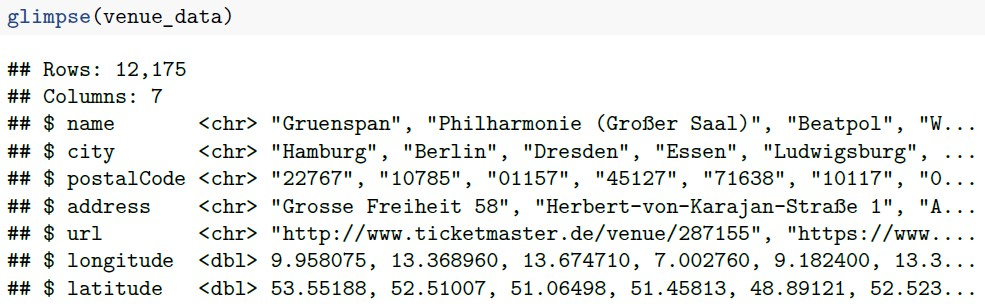

Explanatory note: instructions in block quotes, answers/comments in plain text or inside code junks

```{r setup, include=FALSE}
knitr::opts_chunk$set(echo = TRUE)
```

## General setup

```{r script_header, message=FALSE, warning=FALSE}
# clear workspace
rm(list = ls())
```

## 1. Setting up a new GitHub repository

> Register on github.com in case you have not done this already.
> Initialize a new public repository for this assignment on GitHub.
> For the following exercises of this assignment, follow the standard Git workflow (i.e., pull the latest version of the project to your local computer, then stage, commit, and push all the modifications that you make throughout the project). Every logical programming step should be well documented on GitHub with a meaningful commit message, so that other people (e.g., your course instructor) can follow understand the development history. You can to do this either using Shell commands or a Git GUI of your choice.
> In the HTML file that you submit, include the hyperlink to the project repository (e.g., ht tps://github.com/yourUserName/yourProjectName)

The hyperlink to the project repository is: https://github.com/stefanieritz/DSPM_AssignmentV.git 

## 2. Getting to know the API

> Visit the documentation website for the API provided by ticketmaster.com (see here).
> Familiarize yourself with the features and functionalities of the Ticketmaster Discovery API. Have a particular look at rate limits.

Rate limits for the Ticketmaster Discovery API  are 5000 API calls per day and there is a rate limitation of 5 requests per second.

> Whithin the scope of this assignment, you do not have to request your own API key. Instead retrieve a valid key from the API Explorer. This API key enables you to perform the GET requests needed throughout this assignment.
> Even though this API key is not secret per se (it is publicly visible on the API Explorer website), please comply to the common secrecy practices discussed in the lecture and the tutorial: Treat the API key as a secret token. Your API key should neither appear in the code that you are submitting nor in your public GitHub repository.

```{r store_code, message=FALSE, warning=FALSE}
source("apiKey.R")
```

## 3. Interacting with the API - the basics

> Load the packages needed to interact with APIs using R.

I install and load the relevant packages.

```{r install_load_packages, message=FALSE, warning=FALSE}
# install and load packages
if (!require("httr")) install.packages("httr")
if (!require("jsonlite")) install.packages("jsonlite")
if (!require("tidyverse")) install.packages("tidyverse")

library(httr)  # httr makes http easy
library(jsonlite)  # A Simple and Robust JSON Parser and Generator for R
library(tidyverse)  # Easily Install and Load the 'Tidyverse'
```

> Perform a first GET request, that searches for event venues in Germany (countryCode = "DE"). > Extract the content from the response object and inspect the resulting list. Describe what you can see.
> Extract the name, the city, the postalCode and address, as well as the url and the longitude and latitude of the venues to a data frame. This data frame should have the following structure:


For the first GET request I use the `httr::GET` command with `countryCode = "DE"` and locale = * on the ticketmaster Discovery API (Venue Search). I convert the content of the response object into text by using the `httr::content` function and I convert the JSON object into an Rlist using the `jsonlite::fromJSON` function.

```{r get_request1, message=FALSE, warning=FALSE}
venue_response_p0 <- GET("https://app.ticketmaster.com/discovery/v2/venues",
                      query = list(apikey = ticketmasterKey,
                                   countryCode = "DE",
                                   locale = "*")) %>%
  content(as = "text") %>%  # get content as text
  fromJSON()  # convert JSON object to Rlist
```

The resulting R list consists of the three lists `_embedded`, `_links` and `page`.
In `_embedded` you can find the the data for the specific venues, including name, id, url, city, address, and location. The list `_links` contains the link for the current page (self) and the links for the first, the next and the last page. `page` lists the size, the total elements, the total pages and the current page number.

In order to store the retrieved data in a data frame, I create a tibble with 20 rows for the 20 venues and seven columns. I get to the venue data by using indexing. Then I fill the tibble with the venue data (some variables are nested lists, so they have to be unlisted first).

```{r create_dataframe1_DE, message=FALSE, warning=FALSE}
# create a tibble with 20 rows and 7 columns
n <- 20

venue_data_p0 <- tibble(
  name = character(n),
  city = character(n),
  postalCode = character(n),
  address = character(n),
  url = character(n),
  longitude = numeric(n),
  latitude = numeric(n)
)

# get to venue data
venue_content_p0 <- venue_response_p0[["_embedded"]][["venues"]]

# inspect data frame
names(venue_content_p0)
dim(venue_content_p0)

# fill data frame with values from venue_content
venue_data_p0$name <- venue_content_p0$name
venue_data_p0$city <- unlist(venue_content_p0$city)
venue_data_p0$postalCode <- venue_content_p0$postalCode
venue_data_p0$address <- unlist(venue_content_p0$address)
venue_data_p0$url <- venue_content_p0$url
venue_data_p0$longitude <- unlist(venue_content_p0$location[1])
venue_data_p0$latitude <- unlist(venue_content_p0$location[2])

# transform longitude and latitude to numeric data class
venue_data_p0$longitude <- as.numeric(venue_data_p0$longitude)
venue_data_p0$latitude <- as.numeric(venue_data_p0$latitude)

# inspect data frame venue_data_p0
glimpse(venue_data_p0)
```

## 4. Interacting with the API - advanced

> Have a closer look at the list element named page. Did your GET request from exercise 3 return all event locations in Germany? Obviously not - there are of course much more venues in Germany than those contained in this list. Your GET request only yielded the first results page containing the first 20 out of several thousands of venues. Check the API documentation under the section Venue Search. How can you request the venues from the remaining results pages?

By using the parameter "page"	(Page number,	String) in the GET query the venues for the remaining result pages can be requested.
In order to do that I have to find out the number of total pages, full pages, total elements and how many elements are displayed on the last page.
I create a data frame for 12200 venues and seven variables. The first page (no. 0) cannot be retrieved using the for loop and the last page is incomplete containing 18 venues.

```{r create_dataframe2_DE, message=FALSE, warning=FALSE}
# GET query for page no. 0
venue_response <- GET("https://app.ticketmaster.com/discovery/v2/venues",
                      query = list(apikey = ticketmasterKey,
                                   countryCode = "DE",
                                   locale = "*",
                                   page = 0))
venue_content <- content(venue_response, as = "text") %>% fromJSON()

# get number of elements and pages
totalElements <- as.numeric(venue_content[["page"]][["totalElements"]])
pages <- as.numeric(venue_content[["page"]][["totalPages"]])
# calculate number of full pages and observations on last page
fullPages <- floor(totalElements / 20)
lastPage <- totalElements - fullPages * 20
# calculate number of elements to store in the data frame 
n <- totalElements - 20 - 18

# There are 12238 total results. 20 of them (the first page) are displayed. The results are presented on 612 (0-611) pages (611 full pages (0-610)). 18 results remain on the last page.

# create data frame for n = 12200 venues (all pages, except first and last one)
venue_data_all <- data.frame(
  name = character(n),
  city = character(n),
  postalCode = character(n),
  address = character(n),
  url = character(n),
  longitude = character(n),
  latitude = character(n)
)
```

> Write a for loop that iterates through the results pages and performs a GET request for all venues in Germany. After each iteration, extract the seven variables name, city, postalCode, address, url, longitude, and latitude. Join the information in one large data frame.

I then set up a for loop iterating over all venues on the pages 1-610 (excluding first (no. 0) and last page (no. 611)). The data is stored in a data frame with 12200 rows and seven columns. Some variables are not filled for some venues, so I have to make sure, that those columns nevertheless exist in the new data frame by assigning "NA" to the empty variables.

```{r set_up_for_loop_DE, message=FALSE, warning=FALSE}
# for loop 
for (p in 1:610) {
venue_response_all <- GET("https://app.ticketmaster.com/discovery/v2/venues",
                      query = list(
                        apikey = ticketmasterKey,
                        countryCode = "DE",
                        locale = "*",
                        page = p))
venue_content_all <- content(venue_response_all, as = "text") %>% fromJSON()
venue_content_all2 <- venue_content_all[['_embedded']][['venues']]
  venue_data_all[(20 * p - 19):(20 * p), ] <- data.frame(
    if (is.null(venue_content_all2$name)){
      name = "NA"
      } else {
        name = venue_content_all2$name
        },
    if (is.null(venue_content_all2$city)){
      city = "NA"
      } else {
        city = venue_content_all2$city
      },
    if (is.null(venue_content_all2$postalCode)){
      postalCode = "NA"
    } else {
      postalCode = venue_content_all2$postalCode
      },
    if (is.null(venue_content_all2$address)){
      address = "NA"
    } else {
      address = venue_content_all2$address
      }, 
    if (is.null(venue_content_all2$url)){
      url = "NA"
    } else {
      url = venue_content_all2$url
      }, 
    if (is.null(venue_content_all2$location[1])){
      longitude = "NA"
      } else {
        longitude = venue_content_all2$location[1]
        },
    if (is.null(venue_content_all2$location[2])){
      latitude = "NA"
      } else {
        latitude = venue_content_all2$location[2]
        }
    )
    Sys.sleep(0.2)  # suspends execution for 0.2 seconds to comply with Ticketmaster rate limit
}
```

> The resulting data frame should look something like this (note that the exact number of search results may have changed since this document has been last modified):



I inspect the data frame using the `tibble::glimpse` function.

```{r inspect_dataframe3_DE, message=FALSE, warning=FALSE}
# inspect data frame
glimpse(venue_data_all)
```

Lastly, I retrieve the venue data for the last 18 venues following the same workflow as for the first 20 venues.

```{r create_dataframe3_DE, message=FALSE, warning=FALSE}
# retrieve data for last page (no. 611, 18 venues)
venue_response_last <- GET("https://app.ticketmaster.com/discovery/v2/venues",
                      query = list(apikey = ticketmasterKey,
                                   countryCode = "DE",
                                   locale = "*",
                                   page = 611)) %>% 
  content(as = "text") %>% fromJSON()

# get to venue data
venue_content_last <- venue_response_last[["_embedded"]][["venues"]]

# inspect data frame
names(venue_content_last)
dim(venue_content_last)

# create dataframe for last 18 observations
n <- 18

venue_data_last <- tibble(
  name = character(n),
  city = character(n),
  postalCode = character(n),
  address = character(n),
  url = character(n),
  longitude = numeric(n),
  latitude = numeric(n)
)

# fill data frame venue_data with values from venue_content
venue_data_last$name <- venue_content_last$name
venue_data_last$city <- unlist(venue_content_last$city)
venue_data_last$postalCode <- venue_content_last$postalCode
venue_data_last$address <- unlist(venue_content_last$address)
venue_data_last$url <- venue_content_last$url
venue_data_last$longitude <- unlist(venue_content_last$location[1])
venue_data_last$latitude <- unlist(venue_content_last$location[2])

# inspect data frame venue_data_last
glimpse(venue_data_last)

# add NA columns for longitude and latitude
venue_data_last$longitude <- c(rep("NA", 18))
venue_data_last$latitude <- c(rep("NA", 18))
```

I then bind the three data frames together using the `dplyr::rbind` function.

```{r create_dataframe_total_DE, message=FALSE, warning=FALSE}
# bind together venue_data (first 20, page no. 0), venue_data_all (pages 1-610), venue_data_last (page 611)
venue_data_total <- rbind(venue_data_p0, venue_data_all, venue_data_last)

# transform longitude and latitude to numeric data class
venue_data_total$longitude <- as.numeric(venue_data_total$longitude)
venue_data_total$latitude <- as.numeric(venue_data_total$latitude)

# inspect data frame venue_data_total
glimpse(venue_data_total)
```

## 5. Visualizing the extracted data

> Below, you can find code that produces a map of Germany. Add points to the map indicating the locations of the event venues across Germany.
> You will find that some coordinates lie way beyond the German borders and can be assumed to be faulty. Set coordinate values to NA where the value of longitude is outside the range (5.866944, 15.043611) or where the value of latitude is outside the range (47.271679, 55.0846) (these coordinate ranges have been derived from the extreme points of Germany as listed on Wikipedia (see here). For extreme points of other countries, see here).

Coordinates outside the given ranges are excluded before visualizing the German venue data.
Visualization is done using `geom_polygon()` and `geom_point()` from the `ggplot2` package.

```{r visualize_data_DE, message=FALSE, warning=FALSE}
# exclude venues with coordinates outside the given ranges
venue_data_total$longitude[venue_data_total$longitude < 5.866944 | 
                           venue_data_total$longitude > 15.043611] <- NA
venue_data_total$latitude[venue_data_total$latitude < 47.271679 | 
                        venue_data_total$latitude > 55.0846] <- NA

# visualize venue data using geom_polygon() and geom_point()
venue_data_total %>% ggplot(aes(longitude, latitude)) + 
  geom_polygon(aes(x = long, y = lat, group = group), 
               data = map_data("world", region = "Germany"),
               fill = "grey90", color = "black") +
  theme_void() + 
	coord_quickmap() +
	labs(title = "Event locations across Germany",
			 caption = "Source: ticketmaster.com") +
	theme(title = element_text(size = 8, face = 'bold'),
				plot.caption = element_text(face = "italic")) + 
  geom_point(colour = "orange", size = 0.5)
```

## 6. Event locations in other countries
> Repeat exercises 2 to 5 for another European country of your choice. (Hint: Clean code pays off! If you have coded the exercises efficiently, only very few adaptions need to be made.)

I choose the country 'Spain' (countryCode = "ES"). First, I extract the first 20 venues (page no. 0).

```{r get_request1_ES, message=FALSE, warning=FALSE}
venue_response_p0_ES <- GET("https://app.ticketmaster.com/discovery/v2/venues",
                      query = list(apikey = ticketmasterKey,
                                   countryCode = "ES",
                                   locale = "*")) %>%
  content(as = "text") %>%  # get content as text
  fromJSON()  # convert JSON object to Rlist
```

Then I create a data frame and store the extracted first 20 observations in it.

```{r create_dataframe1_ES, message=FALSE, warning=FALSE}
n <- 20

venue_data_p0_ES <- tibble(
  name = character(n),
  city = character(n),
  postalCode = character(n),
  address = character(n),
  url = character(n),
  longitude = numeric(n),
  latitude = numeric(n)
)

# get to venue data
venue_content_p0_ES <- venue_response_p0_ES[["_embedded"]][["venues"]]

# inspect data frame
names(venue_content_p0_ES)
dim(venue_content_p0_ES)

# fill data frame venue_data with values from venue_content_p0_ES
venue_data_p0_ES$name <- venue_content_p0_ES$name
venue_data_p0_ES$city <- unlist(venue_content_p0_ES$city)
venue_data_p0_ES$postalCode <- venue_content_p0_ES$postalCode
venue_data_p0_ES$address <- unlist(venue_content_p0_ES$address)
venue_data_p0_ES$url <- venue_content_p0_ES$url
venue_data_p0_ES$longitude <- unlist(venue_content_p0_ES$location[1])
venue_data_p0_ES$latitude <- unlist(venue_content_p0_ES$location[2])

# inspect data frame venue_data_p0_ES
glimpse(venue_data_p0_ES)
```

I then set up a data frame for the Spanish venues (pages 1-154 (0-152)) which I fill using a for loop.

```{r create_dataframe2_ES, message=FALSE, warning=FALSE}
# get total number of elements
totalElements <- as.numeric(venue_response_p0_ES[["page"]][["totalElements"]])
pages <- as.numeric(venue_response_p0_ES[["page"]][["totalPages"]])
fullPages <- floor(totalElements / 20)
lastPage <- totalElements - fullPages * 20
n <- totalElements - 20 - 6

# There are 3066 total results. 20 of them (the first page) are displayed. 
# The results are presented on 154 pages (153 full pages). 
# 6 results remain on the last page.

# create data frame for 20 (venues per page) * 152 (full pages) observations.
venue_data_all_ES <- data.frame(
  name = character(n),
  city = character(n),
  postalCode = character(n),
  address = character(n),
  url = character(n),
  longitude = numeric(n),
  latitude = numeric(n)
)

# for loop
for (p in 1:152) {
venue_response_all_ES <- GET("https://app.ticketmaster.com/discovery/v2/venues",
                      query = list(
                        apikey = ticketmasterKey,
                        countryCode = "ES",
                        locale = "*",
                        page = p))
venue_content_all <- content(venue_response_all_ES, as = "text") %>% fromJSON()
venue_content_all2 <- venue_content_all[['_embedded']][['venues']]
  venue_data_all_ES[(20 * p - 19):(20 * p), ] <- data.frame(
    if (is.null(venue_content_all2$name)){
      name = "NA"
      } else {
        name = venue_content_all2$name
        },
    if (is.null(venue_content_all2$city)){
      city = "NA"
      } else {
        city = venue_content_all2$city
      },
    if (is.null(venue_content_all2$postalCode)){
      postalCode = "NA"
    } else {
      postalCode = venue_content_all2$postalCode
      },
    if (is.null(venue_content_all2$address)){
      address = "NA"
    } else {
      address = venue_content_all2$address
      }, 
    if (is.null(venue_content_all2$url)){
      url = "NA"
    } else {
      url = venue_content_all2$url
      }, 
    if (is.null(venue_content_all2$location[1])){
      longitude = "NA"
      } else {
        longitude = venue_content_all2$location[1]
        },
    if (is.null(venue_content_all2$location[2])){
      latitude = "NA"
      } else {
        latitude = venue_content_all2$location[2]
        }
    )
    Sys.sleep(0.2)
}

# inspect data frame venue_data_all_ES
glimpse(venue_data_all_ES)
```

Lastly, I retrieve the Spanish venue data from the last page (no. 153) and store them in a data frame.

```{r create_dataframe3_ES, message=FALSE, warning=FALSE}
# retrieve data for last page (no. 153, 6 venues)
venue_response_last_ES <- GET("https://app.ticketmaster.com/discovery/v2/venues",
                      query = list(apikey = ticketmasterKey,
                                   countryCode = "ES",
                                   locale = "*",
                                   page = 153)) %>% 
  content(as = "text") %>% fromJSON()
  
# get to venue data
venue_content_last_ES <- venue_response_last_ES[["_embedded"]][["venues"]]

# inspect data frame
names(venue_content_last_ES)
dim(venue_content_last_ES)

# create dataframe for last 6 observations
n <- 6

venue_data_last_ES <- tibble(
  name = character(n),
  city = character(n),
  postalCode = character(n),
  address = character(n),
  url = character(n),
  longitude = numeric(n),
  latitude = numeric(n)
)

# fill data frame venue_data_last_ES with values from venue_content_last_ES
venue_data_last_ES$name <- venue_content_last_ES$name
venue_data_last_ES$city <- unlist(venue_content_last_ES$city)
venue_data_last_ES$postalCode <- venue_content_last_ES$postalCode
venue_data_last_ES$address <- unlist(venue_content_last_ES$address)
venue_data_last_ES$url <- venue_content_last_ES$url
venue_data_last_ES$longitude <- unlist(venue_content_last_ES$location[1])
venue_data_last_ES$latitude <- unlist(venue_content_last_ES$location[2])

# inspect data frame venue_data_last_ES
glimpse(venue_data_last_ES)

# add NA columns for longitude and latitude
venue_data_last_ES$longitude <- c(rep("NA", 6))
venue_data_last_ES$latitude <- c(rep("NA", 6))
```

Finally, I bind the three Spanish venue data frames together:

```{r create_dataframe_total_ES, message=FALSE, warning=FALSE}
# bind together venue_data (first 20, page no. 0), venue_data_all (pages 1-152), venue_data_last (page no. 153)
venue_data_total_ES <- rbind(venue_data_p0_ES, venue_data_all_ES, venue_data_last_ES)

# transform longitude and latitude to numeric data class
venue_data_total_ES$longitude <- as.numeric(venue_data_total_ES$longitude)
venue_data_total_ES$latitude <- as.numeric(venue_data_total_ES$latitude)

# inspect data frame venue_data_total
glimpse(venue_data_total_ES)
```

Before I visualize the Spanish venue data, I check the ranges for longitude and latitude.
I decide to visualize the data for venues located on the Spanish mainland and on the Balearic and the Canary Islands.

```{r visualize_data_ES, message=FALSE, warning=FALSE}
head(venue_data_total_ES)

venue_data_total_ES$longitude <- as.numeric(venue_data_total_ES$longitude)
venue_data_total_ES$latitude <- as.numeric(venue_data_total_ES$latitude)

# Spanish extreme points: https://en.wikipedia.org/wiki/List_of_extreme_points_of_Spain
# Conversion of geo coordinates in decimal degrees: https://www.gps-coordinates.net/gps-coordinates-converter 
# North: N43° 47′ 0″ W7° 41′ 0″ ==> 43.78333 // -7.68333
# South: N27° 38′ W17° 59′ ==> 27.63333 // -17.98333
# East: N39° 52′ E4° 19′ ==> 39.86666 // 4.31666
# West: N27° 43′ W18° 09′ ==> 27.71666 // -18.15

# filter for coordinates in the above defined ranges
venue_data_total_ES$longitude[venue_data_total_ES$longitude < -18.15 |
                                venue_data_total_ES$longitude > 4.31666] <- NA

venue_data_total_ES$latitude[venue_data_total_ES$latitude < 27.63333 | 
                               venue_data_total_ES$latitude > 43.78333] <- NA

# visualize Spanish venue data
venue_data_total_ES %>% ggplot(aes(longitude, latitude)) + 
  geom_polygon(aes(x = long, y = lat, group = group), 
               data = map_data("world", region = "Spain"),
               fill = "grey90", color = "black") +
  theme_void() + 
	coord_quickmap() +
	labs(title = "Event locations across Spain",
			 caption = "Source: ticketmaster.com") +
	theme(title = element_text(size = 8, face = 'bold'),
				plot.caption = element_text(face = "italic")) + 
  geom_point(colour = "orange", size = 0.5)
```